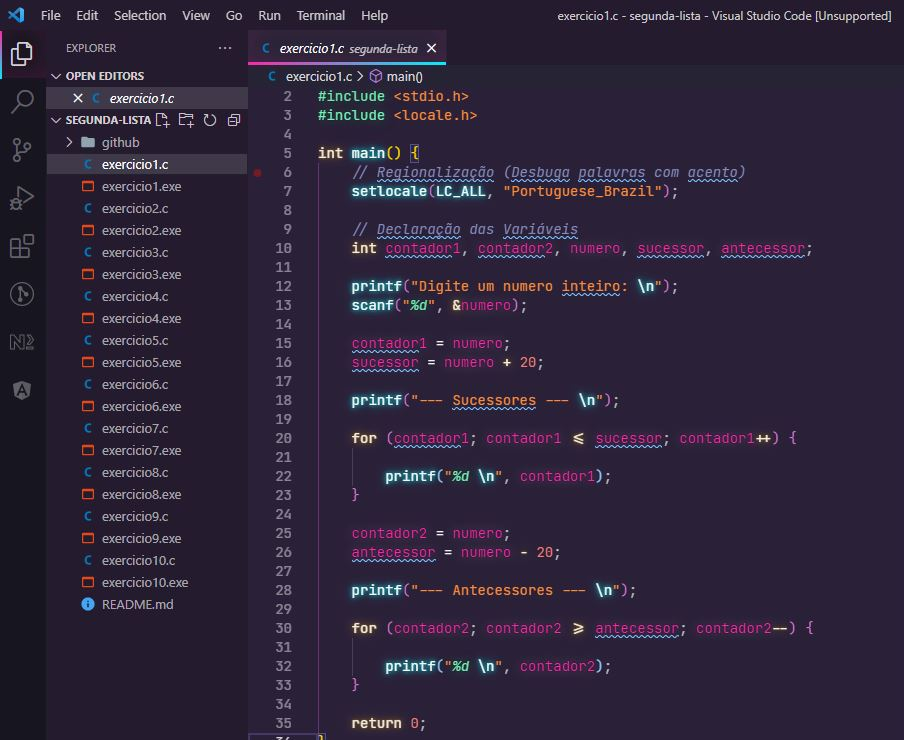

<h1 align="center">
    
</h1>

    <h3> 🔵 Segunda Lista 🔵 </h3>
    
     
    

## Lista 2

Lista de exercícios para praticar algoritmo estruturado e lógica de programação.

## Questões

1.	Ler um número inteiro qualquer e imprimir os seus 20 antecessores, o próprio número e os seus 20 sucessores.

2.	Criar um algoritmo para exibir as tabuadas de multiplicação dos números de 1 a 10.

3.	Escreva um algoritmo para ler um conjunto de 33 formulários contendo cada um a altura e o sexo de uma pessoa (somente ‘M’ ou ‘F’) e imprimir
•	A maior altura e a menor altura da turma
•	A média da altura das mulheres
•	A média da altura dos homens

4.	Raul tem 1,50 m e cresce 2 centímetros por ano, enquanto José tem 1,10 e cresce 5 centímetros por ano. Construir um algoritmo que calcule e imprima quantos anos serão necessários para que José seja maior que Raul.

5.	Entrar com números enquanto forem positivos e imprimir a quantidade, a soma e a média dos números digitados. Um número negativo encerra a execução e não deve constar na soma e nem na contagem.

6.	Escreva um programa que leia números inteiros até que a soma de tais números totalize no mínimo 100. Devem ser lidos tantos valores quantos necessários para que tal valor seja atingido ou superado. Quando isto ocorrer, o programa também deve exibir quantos números foram lidos e sua média.

7.	Num frigorífico são recebidos um número variável de bois a cada dia. Cada boi traz preso no seu pescoço um cartão contendo um número de identificação e seu peso. Implementar um programa que efetue a leitura de todos os números de identificação e peso de cada boi, exibindo ao final o número e o peso dos bois mais gordo e mais magro, bem como o peso médio dos bois. Um número de identificação 0 (zero) indica o final da leitura. Note que não é necessário armazenar os dados de todos os bois.

8.	Um cinema que possui capacidade de 100 lugares está sempre com ocupação total. Certo dia cada espectador respondeu a um questionário, no qual constava: sua idade e sua opinião em relação ao filme (que podia ser ótimo, bom, regular, ruim ou péssimo). Elabore um programa que, lendo estes dados, responda:
•	a quantidade de respostas ótimo;
•	a diferença percentual entre respostas regular e bom;
•	a média de idade das pessoas que responderam ruim; 
•	a porcentagem de respostas péssimo e a maior idade que utilizou esta opção.

9.	Criar um algoritmo para calcular o rendimento em uma poupança programada. Para calcular o rendimento, o usuário deve fornecer o valor constante da aplicação mensal, a taxa e o número de meses. A fórmula usada para este cálculo é:
•	valor acumulado = P * ((1+ i)n –1)/i 
•	onde i = taxa, 
•	P=aplicação mensal e 
•	N = número de meses.

10.	Faça um algoritmo que calcule e imprima o valor de bn. O valor de n deve ser maior do que 1 e inteiro e o valor de b maior ou igual a 2 e inteiro. 

## 🛠️ Linguagem

💻 C

### ☑️ Código:

## 🌟 CEFET / RJ

Essa lista foi passada no meu curso de Sistemas de Informação realizado no CEFET.

